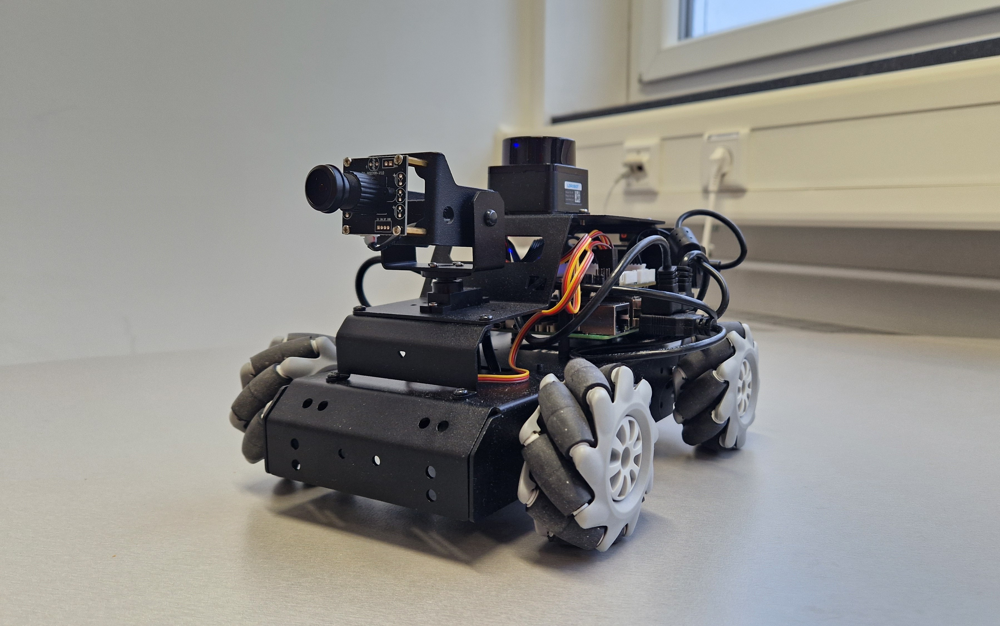

[**THIS REPOSITORY AND README IS A WORK IN PROGRESS**]

[General Information](#general-information)


# MentorPI mecanum-wheel development starter pack

This repository aims to provide a reasonable starting position for ROS2 development on the Raspberry Pi 5 based MentorPi robot platform from Hiwonder. Specifically, the version equipped with the mecanum-wheel drivetrain and the gimbal monocular camera. (Adaptation for other specs should be fairly easy though) See: https://www.hiwonder.com/collections/raspberrypi-bionic-robot/products/mentorpi-m1?variant=41285892702295

# General Information
The MentorPi platform from Hiwonder is a Raspberry Pi 5 based robot platform. As the Raspberry Pi 5 runs normal Linux in this setup, it can be thought of as a normal computer. It can therefore be used with a mouse, keyboard and monitor as one would expect from a standard computer.
As a development framework, ROS2 is used. ROS2 is an open-source framework for building robotic applications. It acts as the middleware between the different components of the robot and also provides tools, libraries, hardware abstraction, device drivers and more for standardized robot development.
For more information, see the ROS2 documentation: https://docs.ros.org/en/jazzy/index.html


# Basic Setup
* In this chapter, the basic setup of the robot is explained. You will install Linux, ROS2 and all necessary drivers for the motors, servos, camera and LIDAR.
`Ubuntu 24.04` together with `ROS2 Jazzy` is used in this project.

* This README walks you through the initial setup for your robot. How and why things work may not be explained in detail. For explanation of the project structure and information about nodes and topics, see the project documentation in the `/docs` folder of this repository.

* This README assumes basic knowledge about the LINUX file system and how to navigate it. For an introduction see: https://www.digitalocean.com/community/tutorials/an-introduction-to-linux-basics

## Linux Setup
First, `Ubuntu 24.04` needs to be installed on the Raspberry Pi 5.

1. **Flash Linux Image**  
The easiest way to flash the Linux image is via the Raspberry Pi imager.
* For Windows, you can download the program here: https://www.raspberrypi.com/software/
* On Ubuntu, you can simply install the program via the following command:
```bash
sudo apt install rpi-imager
```
In the Raspberry Pi imager tool, choose `Raspberry Pi 5` under *Device* and under *Choose OS*: `Other general-purpose OS` -> `Ubuntu` -> `Ubuntu Desktop 24.04.1 LTS (64-bit)`. Then choose the micro SD-card (at least 64GB) you want to install the OS on and click next to continue following the instructions of the tool.

2. **Boot for the first time**
* Put the SD-card in the Raspberry Pi 5, connect a mouse, keyboard and monitor via a micro HDMI cable and boot the Raspberry Pi 5.
* Follow the installer for Ubuntu.

## Installing ROS2
* Follow this guide: https://docs.ros.org/en/jazzy/Installation/Ubuntu-Install-Debs.html to install ROS2 Jazzy on the Raspberry Pi 5. For development, it makes a lot of sense to also have an additional computer with ROS2 installed. This makes remotely diagnosing and controlling the robot much easier. Chose the **Desktop Install** both for the robot and, if applicable, your computer. 
* Run 
```bash
source /opt/ros/jazzy/setup.bash
```
to source the `ROS2` installation. You can also add this to your .bashrc file in order to source the `ROS2` workspace every time a terminal is started. Otherwise, you need to manually enter this command every time you want to work with `ROS2` in a new terminal.

### Install Additional Dependencies
First, update your package manager:
```bash
sudo apt update
```
Then install the following packages:
* **usb_cam**
   - A ROS 2 package for interfacing with USB cameras, enabling video capture and streaming in robotic applications.
```bash
sudo apt install ros-jazzy-usb-cam
```
* **slam_toolbox**  
   - A ROS 2 package for Simultaneous Localization and Mapping (SLAM), providing tools for 2D SLAM, map merging, and long-term mapping.  
   - Essential for robots that require real-time environment mapping and localization in unknown areas.  
```bash
sudo apt install ros-jazzy-slam-toolbox
```
* **navigation2**
   - A ROS 2 package for robot navigation, enabling autonomous path planning, obstacle avoidance, and control.
   - Required for setting up navigation tasks in your robotic project.
```bash
sudo apt install ros-jazzy-navigation2
```
* **joint-state-publisher**
   - A tool for publishing the state of all joints in a robot.
   - Essential for visualizing robot movement or simulating joint positions in RViz.
```bash
sudo apt install ros-jazzy-joint-state-publisher
```
* **xacro**
   - Stands for XML Macros and is used to simplify the creation of URDF files for robot models.
   - Required for generating dynamic robot description files.
```bash
sudo apt install ros-jazzy-xacro
```
* **ros-jazzy-imu-complementary-filter**
   - Provides a complementary filter for IMU data processing in the ROS Jazzy distribution.
   - Helps in fusing accelerometer and gyroscope data for smoother motion tracking.
```bash
sudo apt install ros-jazzy-imu-complementary-filter
```
* **python3-transforms3d**
   - A Python library for handling 3D transformations such as rotations and translations.
   - Used in the `JoystickControl` package for manipulating 3D poses and transformations.
```bash
sudo apt install python3-transforms3d
```
* **python3-pydantic**
   - A Python library for data validation and settings management.
   - Required by the `ros usb_cam` package to handle camera configurations and data structures.
```bash
sudo apt install python3-pydantic
```

## Setup your ROS2 workspace
In addition to the global ROS2 workspace we just installed in `/opt/ros/jazzy` an additional workspace in your home directory `/home/user` is needed. (Substitute your home directory).
In general, ROS2 packages installed via the package manager get installed in the global workspace, while your own projects and code are usually organized in a separate ROS2 workspace inside your home folder. We will follow this structure.

1. **Create the following file structure** inside your home directory ~
```bash
|-- workspace
    |-- ros2_ws
        |-- src
```
You can achieve this with the following command:
```bash
mkdir -p ~/workspace/ros2_ws/src
```
Navigate inside the `ros2_ws` folder and initialize the new workspace with
```bash
colcon build
```
After this, you can source your workspace with
```bash
source install/local_setup.bash
```
You can also add this to your .bashrc file. This way, your workspace is sourced every time a new terminal is opened. Use the correct path, e.g.:
```bash
source /home/user/workspace/ros2_ws/install/local_setup.bash
```
**Make sure** to change `user` to your user.

2. **Download the needed Packages from this repository**
    - Download all folders from the `src` folder and place it in **your** `src` folder.
    - Download the `software` folder and place it in **your** `workspace` folder.

* **Finished file structure**  
The finished file structure should look like the following:
```bash
|-- workspace
    |-- ros2_ws
        |-- build
        |-- install
        |-- log
        |-- src
            |-- calibration
            |-- imu_calib
            |-- ldrobot-lidar-ros2
            |-- peripherals
            |-- driver
            |-- orchestrator_launch
            |-- simulations
    |-- software
        |-- Servo_upper_computer
        |-- collect_picture
        |-- lab_tool
        |-- labelImg
        |-- tool
        |-- yolov5

```
4. **Build the workspace again**  
When you are in the `ros2_ws` folder, you can build the workspace again with
```bash
colcon build
```
Make sure the build process succeeds.

## Set Environment Variables
Because the MentorPi robot comes in different versions, the used version needs to be exported as an environment variable:
```bash
export MACHINE_TYPE=MentorPi_Mecanum
```
This command should also be added to your .bashrc file to ensure the availability of the variable up on startup of a new terminal.

## Set User Permissions
Communication with the expansion board occurs via a serial connection. To enable access, you must ensure your user belongs to the appropriate group with permissions to access serial devices. This is achieved with:
```bash
sudo usermod -a -G dialout $USER
```
You need to restart your Raspberry Pi 5 for this rule to take effect. 

# Testing
If you successfully installed everything we can start testing.

## Test Motor Functions
The expansion board from Hiwonder controls all 4 wheels, the 2 PWM servos the camera is attached to and also allows for access to the IMU. 
All this functionality is managed by the `controller` package, which can be found in `~/workspace/ros2_ws/src/driver`.
With
```bash
ros2 launch controller controller.launch.py
```
you can launch this package. You can verify a successful launch by typing
```bash
ros2 topic list
```
in a second terminal. This will list all topics currently published or subscribed to by all running nodes. After the launch of the `controller` package, the list should look like the following:
```bash
matthias@matthiasT15:~$ ros2 topic list
/cmd_vel
/controller/cmd_vel
/controller_manager/joint_states
/diagnostics
/imu
/imu/rpy/filtered
/imu/steady_state
/imu_corrected
/joint_states
/odom
/odom_raw
/odom_rf2o
/parameter_events
/robot_description
/ros_robot_controller/battery
/ros_robot_controller/bus_servo/set_position
/ros_robot_controller/bus_servo/set_state
/ros_robot_controller/button
/ros_robot_controller/enable_reception
/ros_robot_controller/imu_raw
/ros_robot_controller/joy
/ros_robot_controller/pwm_servo/set_state
/ros_robot_controller/sbus
/ros_robot_controller/set_buzzer
/ros_robot_controller/set_led
/ros_robot_controller/set_motor
/ros_robot_controller/set_oled
/ros_robot_controller/set_rgb
/rosout
/set_odom
/set_pose
/tf
/tf_static
```
Now the fun part begins. Open yet another terminal and type
```bash
ros2 launch peripherals joystick_control.launch.py
```
This launches the joystick_control part of the `peripherals` package. This node handles the controller. Make sure the controller is switched on. The controller should now be connected to the USB dongle plugged in to the Raspberry Pi 5. 
The left joystick controls the linear motion of the robot, while the right controls the rotational momentum. With the D-Pad, you can additionally rotate the camera around. Pressing "START" resets the camera position.

## Test the Camera

### Test the Camera with a connected Monitor
Run
```bash
ros2 launch peripherals usb_cam.launch.py
```
to launch the `camera` node from the `peripherals` package. Typing
```bash
ros2 topic list
```
you should see 
```bash
matthias@matthiasT15:~$ ros2 topic list
/ascamera/camera_publisher/rgb0/camera_info
/ascamera/camera_publisher/rgb0/compressedDepth
/ascamera/camera_publisher/rgb0/image
/ascamera/camera_publisher/rgb0/image_compressed
/ascamera/camera_publisher/rgb0/image_raw/theora
/image_raw/zstd
```
these topics added to your list. `/ascamera/camera_publisher/rgb0/image` is the topic we care about. Run
```bash
ros2 run rqt_image_view rqt_image_view
```
A window should open. In the top left dropdown menu you can choose `/ascamera/camera_publisher/rgb0/image` as the topic you want to display. Now the live video feed from the camera should be displayed.


### Test the Camera from a Remote Computer (a bit more advanced)
Viewing the video feed from a remote computer is not as straight forward. While all `ROS2` topics published by one machine are visible by all machines running `ROS2` in the same network by default, displaying the raw video stream on a remote machine is not generally possible (bandwidth limitation). Instead, the `/ascamera/camera_publisher/rgb0/image_compressed` topic published by the `camera_node` is utilized. By running a decompresser node on the receiving machine, we can decompress the compressed image on the receiving machine and then display this decompressed image.

**Requirements** for streaming the video feed to a different computer in the same network:
- The receiving computer needs to run `ROS2` (preferably `ROS2 Jazzy`)
- A basic `ROS2` workspace needs to be setup on the receiving computer with the `image_decompressor` package installed (The package can be downloaded from this repository).
- Both, the Raspberry Pi 5 and the receiving computer need to be connected to the same network (Eduroam does not work).  

**Setting up the Connection**  
1. Launch the `camera` node on the Raspberry Pi 5:
```bash
ros2 launch peripherals usb_cam.launch.py
```
2. Run the `decompress_image_node` from the `image_decompressor` package on the receiving computer:
```bash
ros2 run image_decompressor decompress_image_node
```
3. Run `rqt_image_view` on the receiving computer and select the `/decompressed_image` topic to display the decompressed image, the `decompress_image_node` publishes.
```bash
ros2 run rqt_image_view rqt_image_view
```

## Test the LIDAR
To test the LIDAR, you need the `controller` node again:
```bash
ros2 launch controller controller.launch.py
```
Now you can launch the `ldlidar_node` present in the `ldrobot-lidar-ros2` folder:
```bash
ros2 launch ldlidar_node ldlidar.launch.py
```
You see the following topics added to your topic list:
```bash
matthias@matthiasT15:~$ ros2 topic list
/bond
/diagnostics
/ldlidar_node/scan
/ldlidar_node/transition_event
/parameter_events
/rosout
```
The `/ldlidar_node/scan` is the important one. 
Open `rivz2` either on the Raspberry Pi 5 or a different computer in the same network running `ROS2` with:
```bash
rviz2 
```
In `rviz2` click on *map* next to *Fixed Frame* in the *Global Options* on the left side. Select *base_footprint* from the dropdown menu. Then click on *add* in the lover left corner and select *LaserScan* from the list. Press *OK*. *LaserScan* should now appear in the left list in red. Click on it to open a dropdown. Click right of *Topic* in the whitespace. An empty dropdown menu should appear. Select `/ldlidar_node/scan` from this menu. The live LIDAR points should now be displayed in the middle. By selecting *Points* next to the *Style* field, you can make the points better visible.


## Test SLAM
**SLAM** is short for *Simultaneous Localization and Mapping* and describes the process of mapping one's surroundings while localizing oneself inside this map. It is key for autonomous navigation in an unknown environment. The `ROS2` package `slam_toolbox` can be used to perform this using live LIDAR data and a complete transformation tree. This tree describes the position of the LIDAR in respect to the main coordinate origin of the robot. This transformation tree is implemented in the `controller` package.
1. Launch the `controller` node: (if not already running)
```bash
ros2 launch controller controller.launch.py
```
2. Launch the ldlidar_node: (if not already running)
```bash
ros2 launch ldlidar_node ldlidar.launch.py
```
3. Launch the `slam_toolbox` with a custom launch file located inside the `orchestrator_launch` package:
```bash
ros2 launch orchestrator_launch slam_toolbox.launch.py
```
4. Launch rviz2 either on the Raspberry Pi 5 or on a computer running `ROS2` inside the same network:
```bash
rviz2
```
5. Click on *Add* in the lower left corner and select *Map* from the list. Then press *OK*. Now select `/map` as the *Topic* in the dropdown Menu under the newly created *Map* entry in the left list. The beginnings of a map should now be visible in the middle of the screen.
6. To add the position of the robot inside the map, click *Add* again and select *TF* from the list. Then click *OK*. The position and orientation should now be displayed. Under *Frames*, you can choose which "position" you want to see. Only selecting *base_footprint* may be the most sensible. 

7. You can now launch the joystick_control from the `peripherals` package again:
```bash
ros2 launch peripherals joystick_control.launch.py
```
Now you should be able to move around with the robot while the map is continuously updated.

## Quality of Life Additions

### Terminator
As you may already noticed, you often have to work with many terminals in paralel. A tiling terminal emulator can help whith this. `Terminator` is a nice choice.
```bash
sudo apt install terminator
```
With
   - `strg`+`shift`+`e` you can split the terminal vertically.
   - `strg`+`shift`+`o` you can split the terminal horizontally.

## SSH Setup
* For easier development, connecting to the Raspberry Pi 5 via SSH is strongly recommended. For this, the Raspberry Pi 5 needs to be connected to the same network as the device from which you want to access the Raspberry Pi 5 (Eduroam does not work). Once this is made sure, you can look up the IP address from the Raspberry Pi 5 with
```bash
hostname -I
```
Now you can connect to the Raspberry Pi 5 from your computer with:
```bash
ssh user@IP-address
```
**Replace** `user` with your user and `IP-address` with the Ip-address of your Raspberry Pi 5. 

* Additionally, installing `sshfs` on your machine will allow you to mount a remote file systems. This way you could for example mount the `workspace` folder of your Raspberry Pi 5 in your file system and conveniently edit files with any code editor you like on your machine.

1. Install `sshfs` on your machine:
```bash
sudo apt install sshfs
```
2. Mount a remote folder:
```bash
sshfs user@IP-address:/remote/file/path /local/file/path
```
Of course **replace** `user` `IP-adress` `/remote/file/path` and `local/file/path` with your specific data. 
   - `/remote/file/path` is the path on the remote machine you want to make accessible from your machine
   - `local/file/path` is the file path on your local machine you want to mount the remote folder in. Creating a special folder like `~/remote_code` may be sensible.

